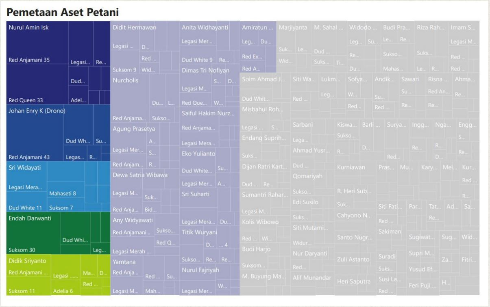
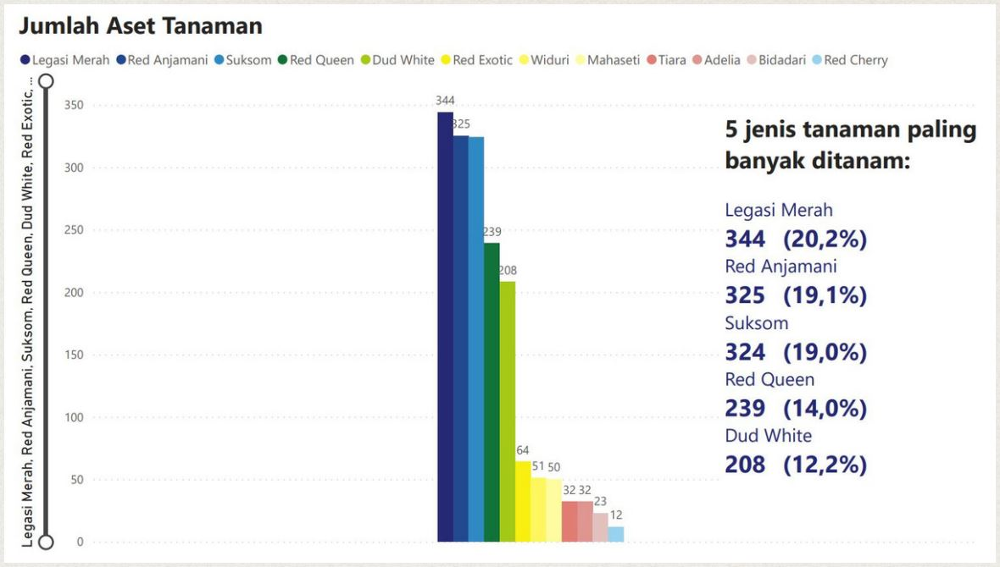
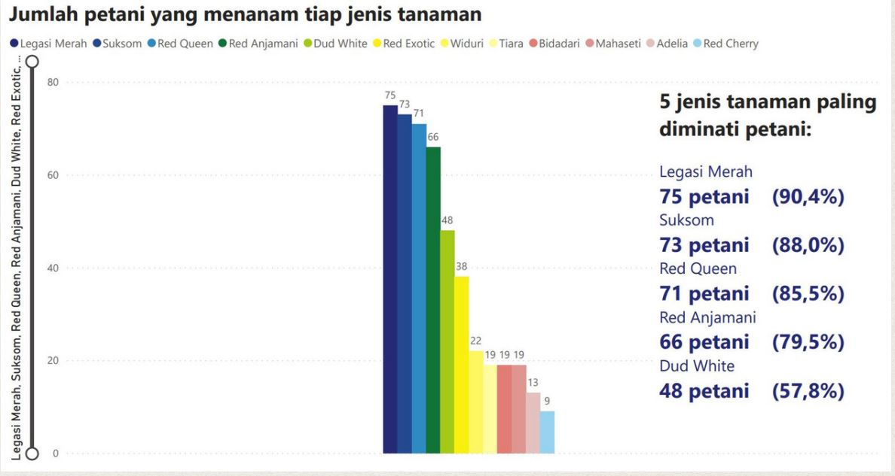

# Asset Analysis of Javaglonema Millenial
The Aglonema Farmers Group named Javaglonema Millennial which is located in Paten, Tridadi, Sleman, DI Yogyakarta. Javaglonema Milenial already has 83 farmer members. 

The farmer groups need plant asset data owned by each member for analysis of achieving the target number of plants. This target will be achieved to realize the Aglonema Tourism Village in 2023. Therefore, technology is needed to analyze the asset inventory data of these farmer groups.

The total plant assets owned by all farmer members in July 2022 are **1704 plants**. Farmer members who have **the 5 most plants** are **Nurul Amin, Johan Enry, Sri Widayati, Endah Darwanti, and Didik Sriyanto**. Other members visualized in light blue are members  have met the target of 25 plants. It is hoped that the member's assets will not decrease. Meanwhile, farmer members visualized in gray are farmer members who have not reached the target, meaning that they do not have at least 25 plants yet. 

Based on data analytic, it can be seen that **the most aglonema plant** production assets are **Legasi Merah with a total of 344 plants**. Followed by the types of plants Red Anjamani, Suksom, Red Queen, and Dud White. **The least number** of aglonema production was **red cherry with total 12 plants**.

**Types of plants favored** by members of the farmer are **Legasi Merah planted by 75 members**, followed by Suksom, Red Queen, Red Anjamani, and Dud White. While Red Cherry is only planted by 9 members. This is validated by the members because legasi merah is easy to maintain and the market is good. Meanwhile, red cherry is the most sensitive type of aglonema and is difficult to treat, so it is vulnerable to death. This can be considered in determining the selling price when the plants begin to be marketed.

 
